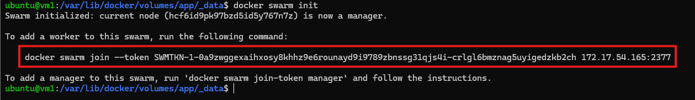

# Docker Swarm - Cluster PHP + MySQL

Projeto de atividade do módulo **Docker: Utilização Prática no Cenário de Microsserviços** do curso **Microsoft - Azure Advanced #2** da plataforma DIO.

## Objetivo

Criar um cluster Docker Swarm para escalar um microserviço com aplicação PHP e banco de dados MySQL.

---

## Pré-requisitos

### Instalação do Docker

```bash
curl -fsSL https://get.docker.com -o get-docker.sh
sudo sh get-docker.sh
```

---

## Parte 1: Configuração Inicial (Servidor Master)

### 1. Criar volumes

```bash
# Volume para dados do MySQL
docker volume create data

# Volume para a aplicação PHP
docker volume create app
```

### 2. Subir o container MySQL

```bash
docker run --name mysql-php -v data:/var/lib/mysql -p 3306:3306 \
  -e MYSQL_ROOT_PASSWORD=pw123 \
  -e MYSQL_DATABASE=php-swarm \
  -dit mysql
```

### 3. Configurar o banco de dados

Conecte no banco com as seguintes credenciais:
- **IP:** IP do servidor Docker
- **Porta:** 3306
- **Usuário:** root
- **Senha:** pw123

Execute o script [sql/banco.sql](sql/banco.sql) para criar a tabela.

### 4. Construir a imagem PHP com mysqli

```bash
docker build -t php-mysqli:7.4 -f docker/Dockerfile.php .
```

### 5. Preparar o arquivo da aplicação

**Importante:** Edite o arquivo `index.php` e altere o IP do MySQL para o IP do container antes de copiar.

```bash
sudo cp index.php /var/lib/docker/volumes/app/_data/
```

### 6. Testar a aplicação localmente

```bash
docker run --name web-server -dt -p 80:80 \
  --mount type=volume,src=app,dst=/var/www/html \
  php-mysqli:7.4
```

Acesse no navegador: `http://[IP_DO_SERVIDOR]`

Se funcionar, remova o container de teste:

```bash
docker rm -f web-server
```

---

## Parte 2: Configuração do Docker Swarm

### 7. Inicializar o Swarm (Servidor Master)

```bash
docker swarm init
```

Copie o comando exibido para adicionar os workers ao cluster:



### 8. Adicionar workers ao cluster

Execute o comando copiado nos demais servidores:

```bash
docker swarm join --token SWMTKN-1-xxxxx...
```

### 9. Criar o serviço no Swarm

```bash
docker service create --name web-server --replicas 3 -dt -p 80:80 \
  --mount type=volume,src=app,dst=/var/www/html \
  php-mysqli:7.4
```

---

## Parte 3: Compartilhamento NFS

Para que todos os nós acessem o mesmo `index.php`, configure o NFS.

### 10. Configurar NFS Server (Servidor Master)

```bash
# Instalar NFS Server
sudo apt-get install nfs-server -y

# Editar arquivo de exportação
sudo nano /etc/exports
```

Adicione a linha:

```
/var/lib/docker/volumes/app/_data *(rw,sync,subtree_check)
```

Exporte a configuração:

```bash
sudo exportfs -ar
```

### 11. Configurar NFS Client (Servidores Workers)

```bash
# Instalar NFS Client
sudo apt-get install nfs-common -y

# Montar o diretório compartilhado
sudo mount -t nfs [IP_DO_MASTER]:/var/lib/docker/volumes/app/_data /var/lib/docker/volumes/app/_data
```

**Exemplo:**
```bash
sudo mount -t nfs 172.17.54.165:/var/lib/docker/volumes/app/_data /var/lib/docker/volumes/app/_data
```

### 12. Verificar o serviço

```bash
# Listar serviços
docker service ls

# Ver réplicas em execução
docker service ps web-server
```

---

## Parte 4: Load Balancer com Nginx

### 13. Preparar arquivos de configuração

Crie os arquivos necessários:

- `docker/Dockerfile` - Imagem do Nginx
- `docker/nginx.conf` - Configuração do load balancer com IPs dos servidores

### 14. Construir a imagem do Nginx

```bash
docker build -t nginx-swarm -f docker/Dockerfile .
```

### 15. Executar o proxy

```bash
docker run --name proxy-swarm -dti -p 4500:4500 nginx-swarm
```

### 16. Acessar a aplicação

Acesse no navegador: `http://[IP_DO_SERVIDOR]:4500`

O Nginx distribuirá as requisições entre os nós do cluster automaticamente.
---

## Comandos Úteis

```bash
# Escalar o serviço
docker service scale web-server=5

# Ver logs do serviço
docker service logs web-server

# Remover o serviço
docker service rm web-server

# Sair do Swarm (worker)
docker swarm leave

# Remover worker do cluster (master)
docker node rm [NODE_ID]
```

---

## Troubleshooting

| Problema | Solução |
|----------|---------|
| Erro "Class 'mysqli' not found" | Verifique se construiu a imagem com `docker/Dockerfile.php` |
| Aplicação não conecta ao MySQL | Atualize o IP do MySQL no `index.php` antes de copiar para o volume |
| Workers não acessam o `index.php` | Verifique se o NFS está montado corretamente com `df -h` |
| Erro ao montar NFS | Use `showmount -e [IP_MASTER]` para verificar exportações |

---

## Estrutura do Projeto

```
docker-swarm/
├── docker/
│   ├── Dockerfile          # Nginx
│   ├── Dockerfile.php      # PHP com mysqli
│   └── nginx.conf
├── images/
│   └── docker_swarm_init.png
├── sql/
│   └── banco.sql
├── index.php
└── README.md
```